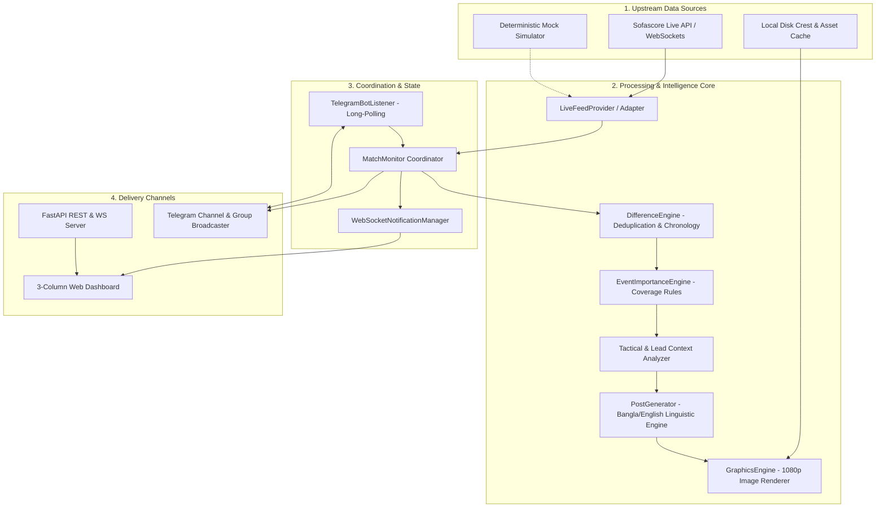

# ⚽ Football Remote Desk & Live Content Engine: Architecture & Technical Specification

> **A Real-Time, Autonomous Football Monitoring, Newsroom Content Generation, Graphics Rendering, and Multi-Channel Publishing System.**

---

## 📑 Table of Contents
1. [Executive Overview](#1-executive-overview)
2. [High-Level System Architecture](#2-high-level-system-architecture)
3. [Step-by-Step Evolution & Milestones](#3-step-by-step-evolution--milestones)
4. [Core Features Breakdown](#4-core-features-breakdown)
   - [4.1 Real-Time Match Monitoring & Difference Engine](#41-real-time-match-monitoring--difference-engine)
   - [4.2 Newsroom Post Generator (Bangla & English)](#42-newsroom-post-generator-bangla--english)
   - [4.3 Social Media HD Graphics Engine (Pillow & TrueType)](#43-social-media-hd-graphics-engine-pillow--truetype)
   - [4.4 Bidirectional Interactive Telegram Bot](#44-bidirectional-interactive-telegram-bot)
   - [4.5 Modern Web UI Dashboard](#45-modern-web-ui-dashboard)
5. [Domain Model & Event Schema](#5-domain-model--event-schema)
6. [API & WebSocket Specification](#6-api--websocket-specification)
7. [Directory Structure & Module Index](#7-directory-structure--module-index)
8. [Configuration & Environment Reference](#8-configuration--environment-reference)

---

## 1. Executive Overview

The **Football Live Content Engine** was built to solve the overnight and real-time operational challenge of sports media newsrooms (specifically following the Bangladeshi media tone, e.g., *Pavilion Sports Desk*). 

Traditional automated feeds produce blunt, robotic, unengaging single-sentence alerts lacking contextual depth. This system transforms raw real-time pitch incidents (goals, red cards, VAR overturns, tactical substitutions, half-time/full-time whistles) into:
- **Engaging Bangla & English journalistic posts** enriched with tactical narrative, assist credit, lead momentum, and standardized match headers.
- **Auto-rendered HD social media graphics** (1:1 Live Goal Cards, 4:5 Starting XI Pitch Boards, 1:1 Full-Time Scorecards).
- **Direct multi-channel distribution** via automated Telegram broadcasting and an interactive 3-column operator Web UI.
- **Two-way Telegram bot commands and inline controls** allowing news editors to manage tracking, fetch live statistics, request graphics, and translate posts directly from chat.

---

## 2. High-Level System Architecture



---

## 3. Step-by-Step Evolution & Milestones

Here is the chronological progression of how the engine was constructed from initial concept to a production-ready system:

### **Phase 1: Real-Time Data Pipeline & Linguistic Foundation**
- **Problem Statement:** Raw sports alerts lacked context, play buildup details, and sounded robotic.
- **Solution:**
  - Implemented `LiveFeedProvider` connecting to live global football feeds with chronological scoreline reconstruction.
  - Implemented `DifferenceEngine` to track state deltas and prevent duplicate alerts.
  - Built `PostGenerator` supporting bilingual output (`bn` / `en`) with Bengali transliterations, Bengali digit conversions, and newsroom voice tones (`BREAKING`, `EDITORIAL`, `CASUAL`).

### **Phase 2: Tactical Context & Match Header Standardization**
- **User Request:** Add rich match context and standardize match headers on every post so social desk readers immediately know the fixture and tournament.
- **Solution:**
  - Prepend standardized header across all events:
    ```text
    ⚽ {Home} vs {Away} | 🏆 {Tournament}
    ━━━━━━━━━━━━━━━━━━━━━━━━━━━━━
    ```
  - Added tactical analysis calculating lead changes, momentum swings (e.g. *“এগিয়ে গেল...”*, *“সমতায় ফিরল...”*), assist combinations, and stoppage time notation.

### **Phase 3: Autonomous Night-Shift Mode & Coverage Levels**
- **Solution:**
  - Created 3 configurable coverage intensity profiles:
    - 🔴 **Full Coverage (সবকিছু):** Goals, cards, VAR, substitutions, half-time, full-time.
    - 🟡 **Standard Coverage (গুরুত্বপূর্ণ ঘটনা):** Goals, red cards, VAR, period ends.
    - 🟢 **Result Only (ফলাফল ও গোল):** Goals and full-time scoreline only.
  - Built autonomous `NightShiftConfig` allowing editors to pre-schedule fixtures before going offline.

### **Phase 4: Social Media HD Graphics Engine**
- **User Request:** Generate ready-to-publish social cards matching modern sports desk standards.
- **Solution:**
  - Built `GraphicsEngine` using Pillow and TrueType typography (`NotoSansBengali`, `Carlito-Bold`, `NotoSans`).
  - Implemented 3 visual card formats:
    1. **Live Goal Card (1080x1080 1:1):** Dark glassmorphism, team crests, scorer spotlight, assist line, tactical snippet, and gold minute badge.
    2. **Starting XI Pitch Board (1080x1350 4:5):** 4-3-3 tactical pitch board with jersey numbers, tactical roles, matchup banner, and substitutes bench.
    3. **Full-Time Scorecard (1080x1080 1:1):** Final score, goalscorers breakdown by team, and possession/shots comparison bars.

### **Phase 5: Bidirectional Telegram Bot & Channel Controller**
- **User Request:** Give the Telegram bot full two-way control over the monitoring desk.
- **Solution:**
  - Built `TelegramBotListener` with async long-polling.
  - Registered official bot command menu (`/status`, `/live`, `/nightshift`, `/stats`, `/lineups`, `/help`).
  - Added interactive inline keyboards to every post (`[🔁 Translate]`, `[📊 Stats]`, `[🖼️ Card]`, `[❌ Delete]`).
  - Configured multipart photo dispatching with automatic HTTP 429 retry-after backoff.

### **Phase 6: Web Dashboard Modals & Open-Source Release**
- **Solution:**
  - Integrated modal viewer on `http://localhost:8000/` with live tabs (`Goal Card`, `Starting XI`, `Full-Time`) and 1-click PNG download.
  - Initialized git repository with secure configuration and published to GitHub: [`ameek/football-live-content-engine`](https://github.com/ameek/football-live-content-engine).

---

## 4. Core Features Breakdown

### 4.1 Real-Time Match Monitoring & Difference Engine
- **Polling Loop:** Asynchronous non-blocking tick evaluating all active monitored matches every 15 seconds.
- **Chronological Running Score Reconstruction:** Reconstructs exact score state at the exact second a goal occurred rather than relying on stale totals.
- **Difference Engine:** Maintains an internal state hash per match, ensuring net-new incidents trigger exactly one broadcast event.

### 4.2 Newsroom Post Generator (Bangla & English)
- **Zero Hallucination:** Generates posts strictly from verified provider events, commentary snippets, and statistics.
- **Linguistic Engine (`src/engine/post_generator.py`):**
  - Converts English numerals to Bengali digits (`0-9` -> `০-৯`).
  - Dynamic team name transliteration dictionary (e.g. *Real Madrid* -> *রিয়াল মাদ্রিদ*, *Arsenal* -> *আর্সেনাল*).
  - Event-specific formatting for Goals, Penalties, Own Goals, Yellow Cards, Red Cards, Double Yellows, Substitutions, VAR Reviews/Overturns, Half-Time, and Full-Time.

### 4.3 Social Media HD Graphics Engine
- **Pixel-Perfect Rendering (`src/engine/graphics_generator.py`):**
  - Dark glassmorphism color palette (`#0a0e17`, `#0f1828`, gold accents `#ffd700`, crimson accents `#ff4b4b`).
  - Crest asset caching: Automatically downloads and caches official team and tournament badges on local disk.
  - Cross-platform TrueType typography support with fallback chains.

### 4.4 Bidirectional Interactive Telegram Bot
- **Real-Time Channel Publishing:** Sends formatted Markdown posts with team crests and inline interactive buttons.
- **Command Menu (`TelegramBotListener`):**
  - `/status` — Displays active Night-Shift status and tracked fixtures count.
  - `/live` — Lists all live matches worldwide with current minutes and scores.
  - `/nightshift on|off` — Arms or disarms the overnight automated newsroom desk.
  - `/stats <match_id>` — Returns possession, total shots, shots on target, and xG.
  - `/lineups <match_id>` — Returns confirmed Starting XI and substitutes.
- **Inline Button Callbacks:**
  - `[🔁 Translate]` — Toggles post between Bengali and English.
  - `[📊 Stats]` — Injects live match statistics into the chat.
  - `[🖼️ Card]` — Generates and uploads the HD visual match graphic.
  - `[❌ Delete]` — Removes post from the channel.

### 4.5 Modern Web UI Dashboard (`src/api/app.py`)
- **3-Column Real-Time Grid:**
  1. **Column 1: Live Match Explorer:** Real-time search, custom league dropdown with tournament crests, quick filter pills, and coverage selectors.
  2. **Column 2: Pitch Ticker:** Live event stream via WebSockets with minute badges and score updates.
  3. **Column 3: Post Section:** Social queue with in-line editing textarea, 1-click clipboard copy, approval buttons, and graphics preview.
- **Bottom Calendar Section:** Fixture calendar for Tonight, Tomorrow, and Next 3 Days with pre-scheduling capabilities.
- **HD Graphics Preview Modal:** Instant card rendering with download action.

---

## 5. Domain Model & Event Schema

### Match Model (`src/domain/models.py`)
```python
class Match(BaseModel):
    id: str
    tournament_name: str
    tournament_category: str
    tournament_logo_url: Optional[str] = None
    home_team: Team
    away_team: Team
    status: MatchStatus
    status_detail: str
    minute: Optional[int] = None
    score: Score
    start_time: Optional[datetime] = None
    coverage: CoverageProfile = CoverageProfile.STANDARD
    auto_generate: bool = True
    auto_publish: bool = False
    language: Language = Language.BANGLA
    voice_style: NewsVoiceStyle = NewsVoiceStyle.BREAKING
```

### Domain Event Schema (`src/domain/events.py`)
```python
class DomainEventType(str, Enum):
    GOAL = "GOAL"
    PENALTY_GOAL = "PENALTY_GOAL"
    OWN_GOAL = "OWN_GOAL"
    RED_CARD = "RED_CARD"
    YELLOW_RED_CARD = "YELLOW_RED_CARD"
    YELLOW_CARD = "YELLOW_CARD"
    SUBSTITUTION = "SUBSTITUTION"
    VAR_DECISION = "VAR_DECISION"
    VAR_OVERTURN = "VAR_OVERTURN"
    PERIOD_HALF_TIME = "PERIOD_HALF_TIME"
    PERIOD_FULL_TIME = "PERIOD_FULL_TIME"
```

---

## 6. API & WebSocket Specification

| Method | Endpoint | Description |
| :--- | :--- | :--- |
| `GET` | `/` | Web UI Dashboard |
| `GET` | `/api/matches/live` | Retrieve live matches with tracking status |
| `GET` | `/api/matches/scheduled` | Retrieve upcoming fixtures calendar |
| `POST` | `/api/matches/configure` | Set tracking & coverage level for a match |
| `POST` | `/api/monitor/poll-now` | Force immediate polling cycle |
| `POST` | `/api/nightshift/start` | Arm overnight automated session |
| `POST` | `/api/nightshift/stop` | Disarm overnight session |
| `GET` | `/api/posts` | List generated newsroom posts |
| `PATCH` | `/api/posts/{post_id}` | Edit, approve, or publish post |
| `GET` | `/api/graphics/goal/{match_id}` | Render 1080x1080 Live Goal Card PNG |
| `GET` | `/api/graphics/lineup/{match_id}` | Render 1080x1350 Starting XI Pitch Card PNG |
| `GET` | `/api/graphics/fulltime/{match_id}` | Render 1080x1080 Full-Time Scorecard PNG |
| `GET` | `/api/logos/team/{team_id}` | Serve cached team crest PNG |
| `GET` | `/api/logos/tournament/{id}` | Serve cached tournament crest PNG |
| `WS` | `/api/ws/live-events` | WebSocket real-time incident & post stream |

---

## 7. Directory Structure & Module Index

```text
football-live-content-engine/
├── data/
│   └── cache/logos/               # Disk cache for downloaded team & league crests
├── src/
│   ├── api/
│   │   ├── app.py                 # FastAPI application, lifespan & Web UI Dashboard
│   │   └── routes.py              # REST API & WebSocket route handlers
│   ├── domain/
│   │   ├── events.py              # Domain event taxonomy & models
│   │   └── models.py              # Match, Team, Post, and Config domain entities
│   ├── engine/
│   │   ├── difference_engine.py   # State tracking & deduplication engine
│   │   ├── graphics_generator.py  # Pillow-based HD social graphics renderer
│   │   ├── importance_engine.py   # Coverage rules & event filter engine
│   │   ├── monitor.py             # MatchMonitor background polling coordinator
│   │   ├── post_generator.py      # Linguistic Bangla & English post generator
│   │   └── websocket_manager.py   # WebSocket broadcast connection manager
│   ├── providers/
│   │   ├── base.py                # Abstract FootballDataProvider interface
│   │   ├── live_feed_provider.py  # Upstream live feed adapter with score reconstruction
│   │   └── mock_provider.py       # Deterministic offline mock simulator
│   ├── publishers/
│   │   ├── telegram_bot_listener.py # Bidirectional Telegram bot long-polling listener
│   │   └── telegram_publisher.py    # Telegram channel dispatcher with inline buttons
│   ├── storage/
│   │   └── image_cache.py         # Async disk caching service for crests & images
│   ├── cli.py                     # CLI commands (`serve`, `simulate`)
│   └── config.py                  # Pydantic Settings & environment loader
├── tests/
│   ├── test_bangla_generator.py   # Bengali linguistic & digit conversion tests
│   ├── test_difference_engine.py  # Deduplication tests
│   ├── test_domain.py             # Domain model validation tests
│   ├── test_graphics_engine.py    # Pillow 1080p card rendering tests
│   ├── test_importance_engine.py  # Coverage profile filter tests
│   └── test_post_generator.py     # Post generation tests
├── .env.example                   # Example environment configuration
├── pyproject.toml                 # Poetry/Pip project configuration
└── requirements.txt               # Locked production dependencies
```

---

## 8. Configuration & Environment Reference

| Variable | Type | Default | Description |
| :--- | :--- | :--- | :--- |
| `PROVIDER_TYPE` | `string` | `LIVE` | `LIVE` (real feeds) or `MOCK` (offline simulation) |
| `POLL_INTERVAL_SECONDS` | `integer` | `15` | Polling tick frequency in seconds |
| `TELEGRAM_BOT_TOKEN` | `string` | — | Telegram Bot API Token (`@Football_post_bot`) |
| `TELEGRAM_CHAT_ID` | `string` | `-1004339732117` | Target Telegram Channel / Group Chat ID |
| `DEFAULT_PLATFORM` | `string` | `FACEBOOK` | Target social platform formatting template |
| `DEFAULT_COVERAGE` | `string` | `STANDARD` | Default coverage filter level (`FULL`, `STANDARD`, `RESULT_ONLY`) |
| `HOST` | `string` | `0.0.0.0` | Binding network host |
| `PORT` | `integer` | `8000` | Binding server port |

---
*Built with ❤️ for sports journalists, remote news desks, and automated content operations.*
